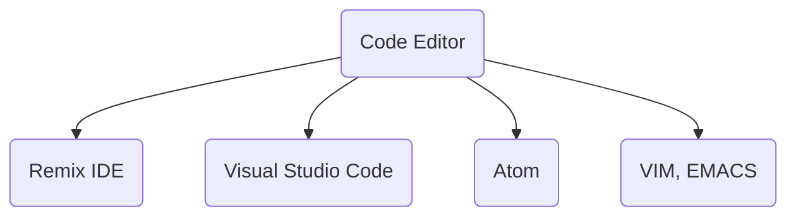

# Documentation

Here we collect references and Equalizer Academy documentation.

```mermaid
graph TD
    A(Code Editor) --> CE1(Remix IDE)
    A --> CE2(Visual Studio Code)
    A --> CE3(Atom)
    A --> CE4(VIM, EMACS)
```

```mermaid
graph TD
    B(Blockchain) --> BCP(Public Mainnet)
    B --> BCT(Public Testnetm)
    B --> BCPV(Private)

    BCP --> BCP1(Ethereum)
    BCP --> BCP2(BSC)
    BCP --> BCP3(Polygon)

    BCT --> BCT1(Rinkeby)
    BCT --> BCT2(Ropsten)
    BCT --> BCT3(BSC Testnet)
    BCT --> BCT4(Polygon Testnet)

    BCPV --> BCPV1(Ganache)
```