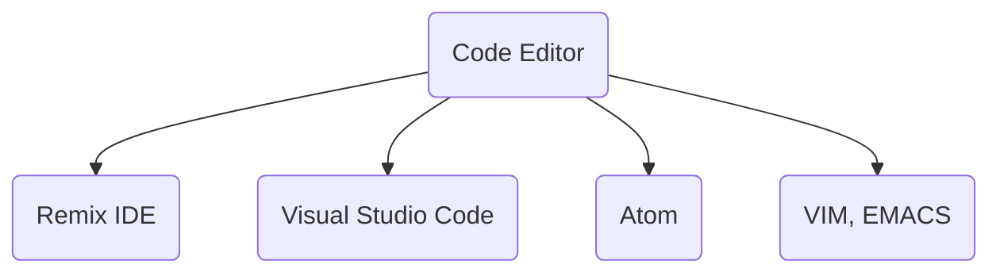

# Documentation

Here we collect references and Equalizer Academy documentation.



```mermaid
graph TD
    B(Blockchain) --> BCP(Public Mainnet)
    B --> BCT(Public Testnetm)
    B --> BCPV(Private)

    BCP --> (Ethereum)
    BCP --> (BSC)
    BCP --> (Polygon)

    BCT --> (Rinkeby)
    BCT --> (Ropsten)
    BCT --> (BSC Testnet)
    BCT --> (Polygon Testnet)

    BCPV --> Ganache
```
