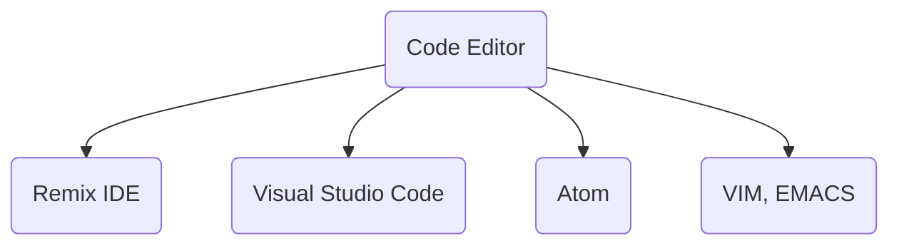
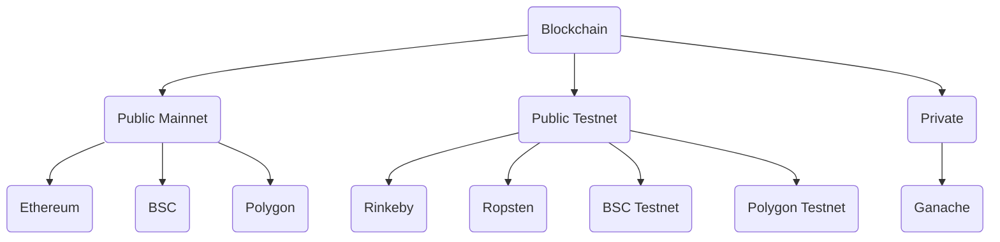

# Documentation

## Setting up the environment

To begin with development, you need to set up your development environment that consists of

- Code editor to write and develop your software
- Blockchain network deploy, test and run your smart contracts
- Testing and deployment suites

### Code editors and IDEs

In the diagram below, we summarise the most popular Solidty code editors and [IDE](https://www.redhat.com/en/topics/middleware/what-is-ide)

Try out different code editors and select the one that you're most comfortable
working with. Most of well-supported code editors come with great plugins that
ease your development, testing, debugging, and deployments.

### Blockchain networks

After you design, write and build your smart contracts, you need to deploy them
to one of the blockchains and test them. In the table below, we list several
options. Mainnets are used only for production-grade smart contracts. Testnets
and Ganache are used for development and testing.

